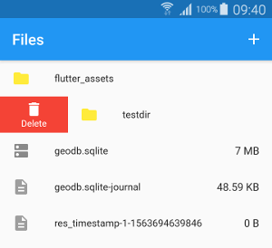

# Filex

Configurable file explorer widget for Flutter



## Usage

Simple:

   ```dart
   import 'package:filex/filex.dart';
   import 'package:path_provider/path_provider.dart';

   dir = await getApplicationDocumentsDirectory();
   final controller = FilexController(path: dir.path);
   Filex(controller: controller);
   ```

With leading and trailing builders:

   ```dart
   import 'package:filex/filex.dart';

   Filex(
     compact: true,
     directory: Directory("some_dir_path"),
     directoryTrailingBuilder: (context, item) {
       return GestureDetector(
         child: Padding(
           padding: const EdgeInsets.fromLTRB(0, 0, 3.0, 0),
           child: Icon(Icons.file_download,
             color: Colors.grey, size: 20.0)),
           onTap: () => doSomething(item));
   })
   ```

Trailing and leading options are: `fileTrailingBuilder`, `directoryLeadingBuilder` and `directoryTrailingBuilder`

## Controller

Include dialogs to add and delete directories:

   ```dart
   class FileExplorer extends StatelessWidget {
   @override
   Widget build(BuildContext context) {
      final controller = FilexController(path: dir.path);
      return Scaffold(
         appBar: AppBar(
           title: const Text("Files"),
           actions: <Widget>[
             IconButton(
               icon: Icon(Icons.add),
               onPressed: () => controller.addDirectory(context),
             )
           ],
         ),
         body: Filex(
           controller: controller,
           actions: <PredefinedAction>[PredefinedAction.delete],
         ),
       );
     }
   }
   ```

Available controller actions:

`controller.delete(DirectoryItem item)` : delete a file or directory

`controller.createDirectory(String name)` : create a directory

`controller.ls()` : list the current directory

`controller.dispose()` : dispose the bloc when finished using
